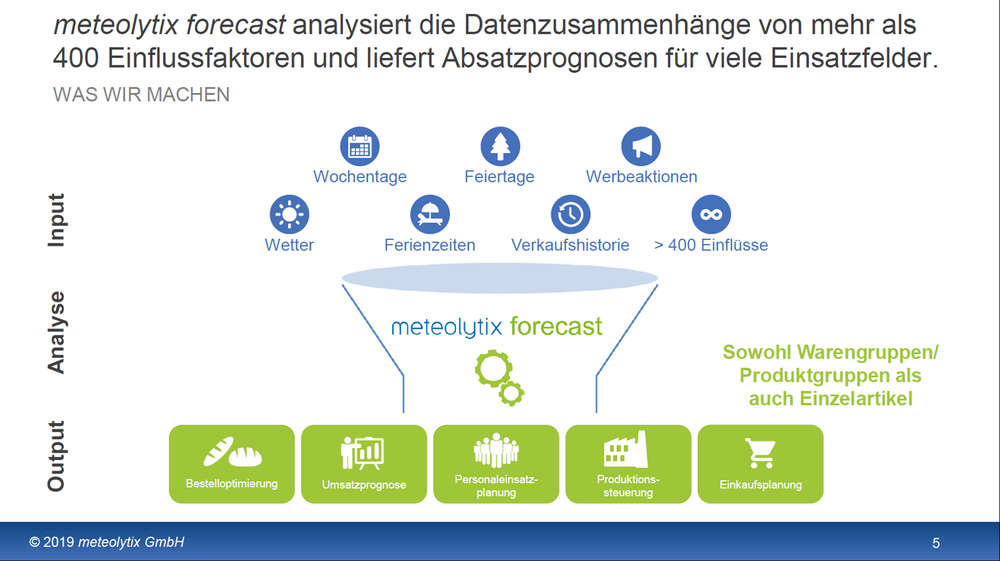

# Praxisprojekt: Bäckerei Umsatz Vorhersage Modell

## Link zu Repository

https://github.com/CausaSui80/Gruppe1

## Beschreibung

Deep Learning Projekt in RStudio zur Vorhersage des Umsatzes einer Bäckerei anhand historischer Daten aus dem Sales-Datensatz von Meteolytix von 6 Produkten. Der in diesem Projekt verwendete Verkaufsdatensatz für tägliche Verkäufe erstreckt sich über einen Zeitraum von 2013 bis 2019. Der Zweck dieses Projekts ist die Entwicklung eines Vorhersagemodells und die Vorhersage des erwarteten Umsatzes für die Bäckerei zu einem bestimmten Zeitpunkt in der Zukunft. Dieses Projekt beinhaltet eine explorative Analyse und das Modell basiert auf einem neuronalen Netzwerk. Hinweis: Die Daten für dieses Projekt sind privat und können nicht weitergegeben werden, nur die Ergebnisse werden zur Verfügung gestellt.

### Aufgabenyp

[Lineare Regression/ Neuronales Netz]

### Zusammenfassung der Ergebnisse

- **Bestes Modell:** [Name of the best-performing model]
- **Evaluation Metrics:** [e.g., Accuracy, F1-Score, MSE]
- **Ergebnisse:** [e.g., 95% accuracy, F1-score of 0.8]

## Dokumentation

1. **[Literature Review](0_LiteratureReview/README.md)**
2. **[Dataset Characteristics](1_DatasetCharacteristics/exploratory_data_analysis.ipynb)**
3. **[Baseline Model](2_BaselineModel/baseline_model.ipynb)**
4. **[Model Definition and Evaluation](3_Model/model_definition_evaluation)**
5. **[Presentation](4_Presentation/README.md)**

## Cover Image

